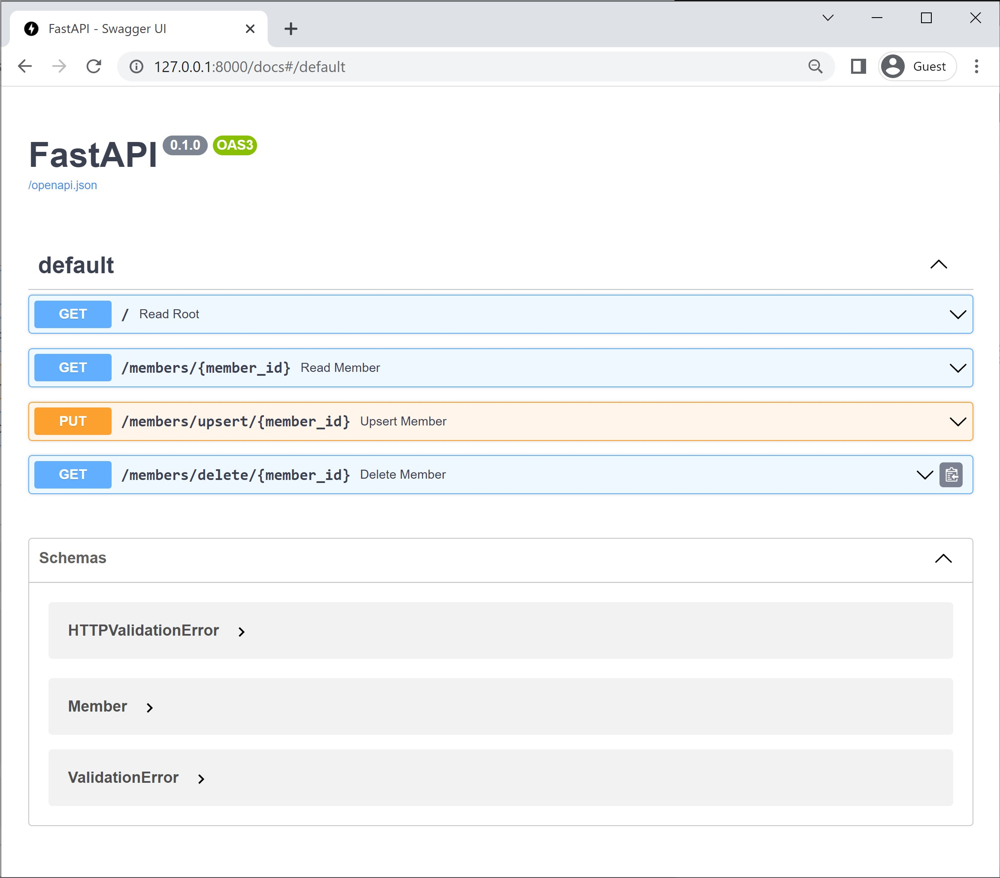

# Getting Started with DataStax AstraDB - Custom REST API Development with Python

[Japanese](./README-ja.md)

## About this repository
Developers using DataStax AstraDB can easily verify connections from various programming languages by following the instructions provided in the AstraDB control plane (on the Connect tab of the database dashboard).
The sample program used there, for example, in Python, as its name(`connect_database.py`) suggests, connects to the database and displays information in the system table (`system.local`), for connection confirmation.

The purpose of this repository is to go a step further from the sample program above and provide code for custom REST API development that covers CRUD operations on a user-defined table, not a system table like `system.local`.

By default, AstraDB provides a REST API for CRUD operations on Cassandra tables.
So at first glance, the code we're dealing with might look like reinventing the wheel.
However, in actual projects, it is not common that APIs provide just direct data manipulations to tables, but it is often accompanied by some kind of business logic. For example, one API call may involve operations on multiple tables.
The code provided here does not implement any specific logic, but can be thought of as a simulation of such an API with business logic, or as a template for developing such an API.

The program also provides a web UI that complies with the Open API.




## Preparation

It is assumed that you've already aware of the instructions provied in the AstraDB control plane (on the Connect tab of the database dashboard).

## My Local Environment

```
conda create -n datastax -y python=3 pip
conda activate datastax
```

```
python --version
Python 3.10.4
pip --version
pip 21.2.4 from C:\Users\yoshi\Anaconda3\envs\datastax\lib\site-packages\pip (python 3.10)
```

## Python Package

```
pip install fastapi
pip install uvicorn[standard]
```

## Data

### keyspace: `test`

### Table: `member`
```
CREATE TABLE test.member (
    id text PRIMARY KEY,
    first_name text,
    last_name text
) 
```

## Configure

Please edit `astra_main.py` by following the instructions provied in the AstraDB control plane (on the Connect tab of the database dashboard).

## Usage

```
uvicorn astra_main:app --reload
```

Open the following link 

http://127.0.0.1/8000/docs


